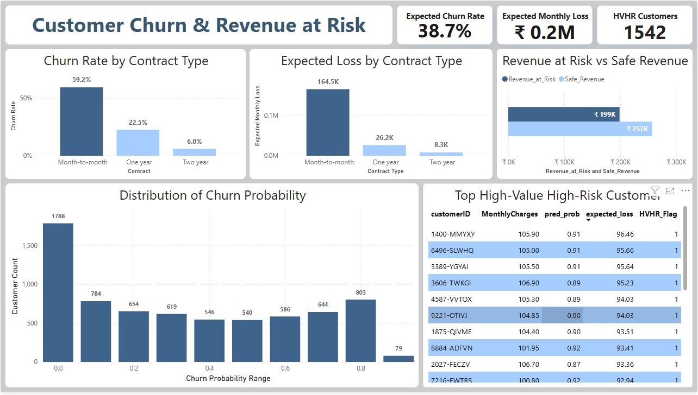

# Telecom Customer Churn Analysis

This project explores why customers leave a telecom service and what that means for monthly revenue. The aim is to spot who is at risk, understand why they leave, and show how much money the business could lose if they churn.

The work turns raw data into clear, practical insights that managers and teams can act on without needing technical knowledge.

## Project Overview

We used historical customer data to answer three core questions:

- Who is leaving  
- Why they are leaving  
- How much revenue is at risk if they do  

The focus stays on business value. Every insight connects back to either customer retention or revenue protection. Instead of just predicting churn, the project highlights specific customer groups to target and the revenue impact of each group.

## Interactive Power BI Dashboard

An interactive Power BI dashboard presents the results in a simple and visual way. It allows users to:

- View churn risk at customer and segment level  
- See expected revenue loss by contract type and customer value  
- Explore high value and high risk customers  

  

The dashboard supports fast decision making. Leaders can filter, drill down, and immediately see which customers should get a call, an offer, or better support.
  [ Note: `38.7%` is the average predicted probability of churn across customers (model's estimated risk).]
## Key Findings

The analysis reveals a clear picture of who is leaving and what it costs.

#### Who is leaving

- Around 26.5% of customers are leaving   [ Note: `26.7%` of customers in the dataset are labeled as churned (ground truth).]
- Senior citizens leave more often than other age groups  
- Month to month contract customers are much more likely to churn  
- Customers paying by electronic check are more likely to cancel  
- Most churn happens in the first few months of service  
- Customers with zero to three services leave more often, while those with six or more services usually stay  

These patterns show that early relationship management and service bundling play a big role in keeping customers.

#### Revenue at risk

From a revenue point of view, the risk is significant:

- 43.6% of monthly revenue is at risk, around ₹1,98,932 per month  
- 1,542 high value customers account for ₹1,35,619 of that possible loss  
- Month to month contracts carry the highest churn risk and largest expected loss  
- Longer contracts have much lower expected loss and are more stable  

This means a relatively small but important group of customers can drive a large share of potential revenue loss.

## What drives churn

The data highlights patterns that increase or reduce the chance of churn.

More likely to leave:

- High monthly bills and high total charges  
- Use of internet services without add on support  
- Not having online backup  

More likely to stay:

- Long term contracts  
- Access to tech support  
- Use of phone services  
- Longer tenure with the company  
- Having online security services  

These drivers give clear levers the business can use to shape offers and service design.

## Recommendations

Based on the findings, the project suggests a focused action plan.

First, concentrate on customers with month to month contracts, as they combine high risk and high revenue impact. Second, closely track high value customers who also show high churn probability and treat them as priority accounts.

Key actions include:

- Create targeted retention campaigns for month to month customers  
- Proactively engage the 1,542 high value high risk customers  
- Encourage customers to add services such as online backup and tech support  
- Offer tailored discounts or plans to customers with very high bills  
- Reach out early in the first few months of a customer’s journey with support and value messages  

These actions are designed to be practical for sales, retention, and customer success teams.

## Business impact

This project does more than identify churn. It:

- Shows which customers and segments could cause the largest revenue loss  
- Helps teams decide where to focus retention efforts for maximum return  
- Translates model predictions into clear money at risk, in rupees per month  
- Supports informed and timely decisions for management and operations  

By connecting churn risk with real revenue and clear customer groups, the analysis becomes a tool for everyday business decisions, not just a one time study.

Project by [**Anurag Chauhan**](https://www.linkedin.com/in/theanuragchauhan/)
